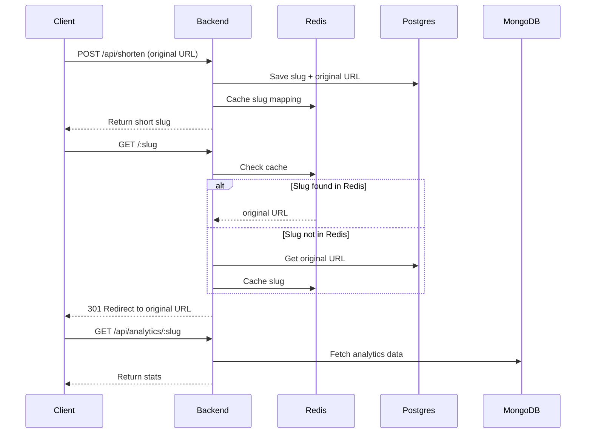
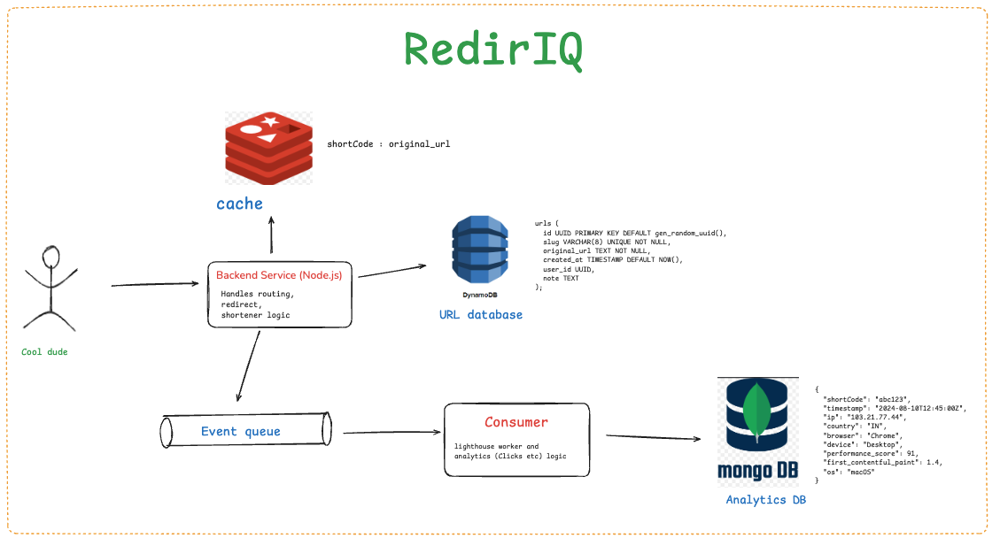

# 📦 redirIQ

**redirIQ** is a modern, performance-aware URL shortener that offers secure, fast redirects combined with detailed analytics and performance scoring. It is designed with scalability and observability in mind using Redis, PostgreSQL/DynamoDB, Kafka, and MongoDB in a decoupled architecture.

---

## 🧠 About the Project

redirIQ allows users to shorten long URLs into compact slugs (3–8 characters), track click events (including device, location, referrer), and analyze the destination page's performance using Lighthouse. It caches redirect lookups for speed, logs visits asynchronously to Kafka, and stores analytics data in a store.

Built for developers and marketers alike, redirIQ is fast, extensible, and analytics-rich.

---

## 🧰 Tech Stack

### Frontend
- React + Vite
- TypeScript
- TailwindCSS

### Backend
- Node.js + Express
- TypeScript
- PostgreSQL/DynamoDB (for core URL + performance scores)
- Redis (for fast caching)
- Kafka (event ingestion)
- MongoDB (analytics storage)

---

## Sequence Diagram

### system design HLD

rough thoughts 

---
